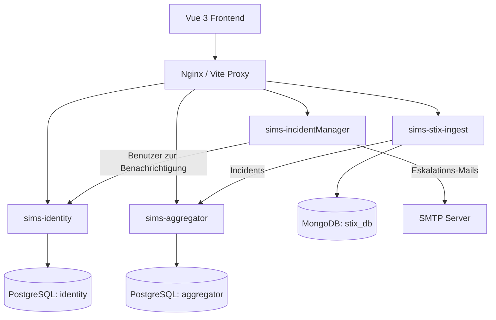
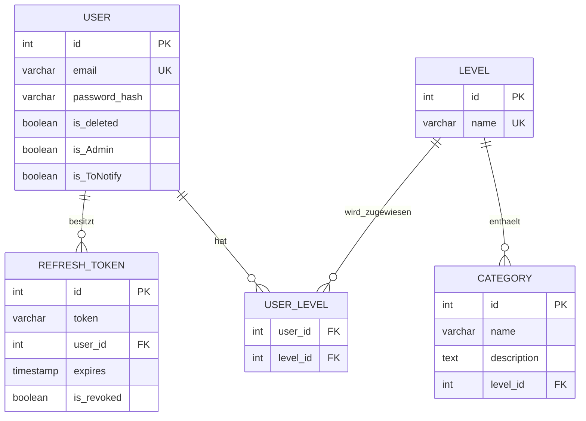
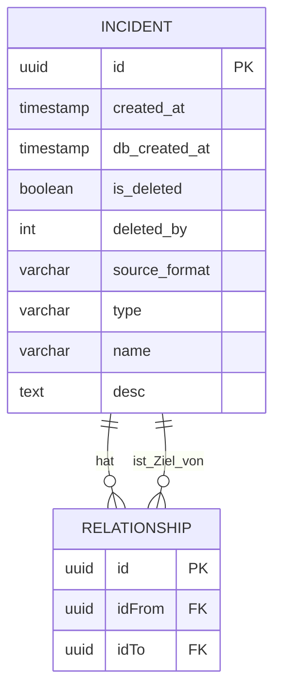
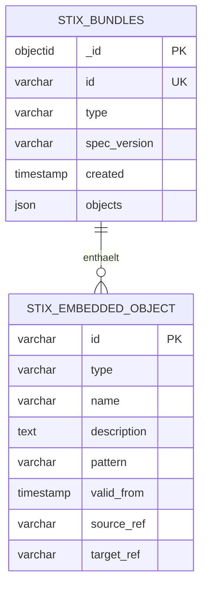

# SIMS-ELITE

> Microservice-Plattform für Incident Response: Erfassen, Verknüpfen, STIX-Import & Auto-Eskalation.

---

## 📖 Overview

**USPs:**

- ⚡ **STIX 2.1 Ingest**: Threat-Intel Import & Weiterleitung (Mongo ➔ Aggregator)
- 🔒 **Rollen & Freigaben**: Zugriffsschutz über Level- & Kategorie-Rechte
- 🚨 **Auto-Eskalation**: Mail-Alert an Admins/Zuständige bei Vorfällen
- 🛡️ **Supply-Chain**: Automatische SBOMs & CVE-Scans via Dependency-Track

### Key Features

- Incident-Graphen & Verknüpfungen (Vis-Network)
- JWT Auth (Access + Refresh Token Rotation)
- Tracing & Structured Logging via SigNoz
- Scalar API-Doku auf jedem Service

---

## 🛠️ Tech Stack

- **Frontend**: Vue 3 (Composition API), Vite, PrimeVue 4, Pinia, Vis-Network
- **Backend**: .NET 10 (ASP.NET Core Web API, C#)
- **Datenbanken**:
  - PostgreSQL 16 (`identity` & `aggregator`)
  - MongoDB 8.0 (`stix_db`)
- **Gateway / Proxy**: Nginx (Production / Docker) & Vite Proxy (Dev)
- **Observability**: OpenTelemetry SDK + SigNoz (OTLP)
- **Security & CI/CD**: Docker, GitHub Actions, CycloneDX (SBOM), OWASP Dependency-Track

---

## 🏗️ Architecture

👉 **[Vollständige Systemarchitektur & UML-Diagramme (docs/architecture.md)](docs/architecture.md)**



### Kurzüberblick Komponenten:

- **`frontend`**: SPA Dashboard mit Graphenansicht
- **`sims-identity`**: Auth, User, Rollen (Level/Category)
- **`sims-aggregator`**: Incident-Zentrale & Relationen
- **`sims-stix-ingest`**: STIX Threat Intel Ingest & MongoDB Gateway
- **`sims-incidentManager`**: Eskalations-Logik & Mail-Versand

---

## 🗄️ Data Model

Die Datenbank-Schemata sind in einzelnen DBML-Dateien dokumentiert:

- 📄 **[Identity DB Schema (docs/db_Identidy.dbml)](docs/db_Identidy.dbml)** — PostgreSQL: User, RefreshTokens, Levels, Categories
- 📄 **[Aggregator DB Schema (docs/db_aggregator.dbml)](docs/db_aggregator.dbml)** — PostgreSQL: Incidents, Soft-Deletes, Relationships
- 📄 **[STIX Ingest DB Schema (docs/db_stix.dbml)](docs/db_stix.dbml)** — MongoDB: BSON Schema für STIX 2.1 Bundles

GitHub rendert DBML-Dateien nicht direkt. Die folgenden Mermaid-Diagramme zeigen deshalb die Datenmodelle direkt in dieser README; die DBML-Dateien bleiben die editierbaren Schema-Quellen.

### Identity-Datenbank



### Aggregator-Datenbank



### STIX-Ingest-Datenbank



---

## 🚀 Getting Started

Es gibt 3 Docker-Compose-Varianten im Ordner [`./depl-kram`](depl-kram/):

### 1. Lokale Entwicklung (nur DBs starten)

Wenn du Backend-Services und Frontend direkt auf deinem Host per IDE/CLI ausführen willst:

```bash
cd depl-kram/onlydbs-für-local-run
docker compose up -d
```

_Startet Postgres auf Port 5433 & 5434 sowie MongoDB auf Port 27017._

### 2. Lokaler Build (alles aus Source bauen)

Baut alle Docker-Images lokal frisch und startet den kompletten Stack inklusive Nginx:

```bash
cd depl-kram/compose-mit-build-integriert
docker compose up --build -d
```

### 3. Production (Images von GitHub Registry)

Zieht vorgebaute Images direkt aus der GitHub Container Registry:

```bash
cd depl-kram/compose-mit-images-von-github
docker compose up -d
```

---

## 💻 Usage & Running

### Frontend per CLI (Dev-Modus)

```bash
cd frontend
npm install
npm run dev
```

- Frontend läuft unter: `http://localhost:5173`
- Der Vite Dev Server leitet API-Calls automatisch per Proxy an die lokalen Backend-Ports weiter.

### Docker Umgebung

- Frontend & Proxy erreichbar unter: `http://localhost:2000`
- Nginx routet intern auf die Service-Container:
  - `/api/identity/*` ➔ `identity:8080`
  - `/api/aggregator/*` ➔ `aggregator:8080`
  - `/api/incident-manager/*` ➔ `incident-manager:8080`
  - `/api/stix/*` ➔ `sims-stix-ingest:8080`

### API Dokumentation (Scalar)

Im Development-Modus besitzt jeder Service eine interaktive Scalar-Dokumentation:

- **Identity API**: `http://localhost:67/scalar/`
- **Aggregator API**: `http://localhost:88/scalar/`
- **Incident Manager API**: `http://localhost:420/scalar/`
- **STIX Ingest API**: `http://localhost:8080/scalar/`

---

## ⚙️ Prerequisites

- **Docker & Docker Compose** (empfohlen: Docker Desktop v24+)
- **.NET 10 SDK** (für lokale Backend-Entwicklung)
  ```bash
  # EF Core Tools global installieren (falls noch nicht vorhanden):
  dotnet tool install --global dotnet-ef
  ```
- **Node.js** (v22+ oder v24+) & **npm** (fürs Frontend)

---

## 🔑 Environment Variables (.env)

Kopiere `.env.example` bzw. lege die Variablen vor dem Start an:

| Variable                                       | Zweck                              | Standard / Beispiel                    |
| ---------------------------------------------- | ---------------------------------- | -------------------------------------- |
| `JWT__KEY`                                     | Secret Key für Signierung der JWTs | `32+ Zeichen Base64 String`            |
| `ID_POSTGRES_USER` / `_PASSWORD` / `_DB`       | Credentials Identity DB            | `postgres` / `postgres` / `identity`   |
| `AGGR_POSTGRES_USER` / `_PASSWORD` / `_DB`     | Credentials Aggregator DB          | `postgres` / `postgres` / `aggregator` |
| `STIX_MONGO_USER` / `_PASSWORD` / `_DB`        | Credentials STIX MongoDB           | `admin` / `password` / `stix_db`       |
| `OTEL_EXPORTER_OTLP_ENDPOINT__URL`             | SigNoz Ingest URL                  | `https://ingest.us2.signoz.cloud`      |
| `OTEL_EXPORTER_OTLP_ENDPOINT__KEY`             | SigNoz Ingestion Key               | Dein SigNoz Key                        |
| `EMAIL_SERVER` / `_USER` / `_SECRET` / `_PORT` | SMTP Settings für Eskalation       | z.B. Host, Port 587, Auth-Token        |

---

## 🔒 Security

- **JWT Flow**:
  - Kurze Access-Tokens (15 Min.) + Refresh-Token-Rotation (7 Tage, revocable in DB).
  - Validierungsendpoint in Identity zum Token-Prüfen.
- **Rollen & RBAC**:
  - `is_Admin` Flag steuert globale Verwaltungsrechte.
  - User <-> Level Zuordnung filtert Sichtbarkeiten von Incident-Kategorien.
- **Supply Chain Security**:
  - CI-Pipeline generiert bei jedem Release CycloneDX SBOMs.
  - Automatischer Scan auf bekannte Schwachstellen via Dependency-Track.
- **Audit & Soft-Delete**:
  - Gelöschte Einträge verbleiben via `is_deleted = true` und `deleted_by` nachvollziehbar in der DB.

---

## 📊 Logging & Monitoring

- **OpenTelemetry**: Alle .NET Services exportieren Traces und strukturierte Logs direkt via OTLP gRPC/HTTP an SigNoz.
- **Structured Logging**: Variablen immer mit Namen übergeben (nicht mit String-Interpolation `$`), damit SigNoz danach filtern kann:
  ```csharp
  // RICHTIG:
  _logger.LogInformation("User {UserId} hat {Action} ausgeführt.", userId, action);
  ```
- 👉 **[Ausführlicher Logging-Guide (docs/logger-usage.md)](docs/logger-usage.md)**

---

## 📚 Documentation & Useful Links

- 📐 **[Architektur & Dependency-Track Flow](docs/architecture.md)**
- 📋 **[Setup & CLI Befehle](docs/setup-and-commands.md)**
- 🏃 **[Projekt starten (Guide)](docs/running-the-project.md)**
- 📝 **[Logging Guidelines (SigNoz)](docs/logger-usage.md)**
- 🔐 **[Semgrep Security Report](docs/semgrep-security-report.md)**
- 🔗 **[Nützliche Links & Ports](docs/useful-links.md)**

---

## 👥 Contributing

Projektteam / Elite-Entwickler:

- Yannick Schneider is251007
- Tobias Vonmets is251001
- Andreas Buick is251034

---

## 📄 License

Proprietär — Alle Rechte vorbehalten.  
Keine Open-Source-Lizenz; Nutzung ausschließlich für interne/autorisierte Zwecke.
