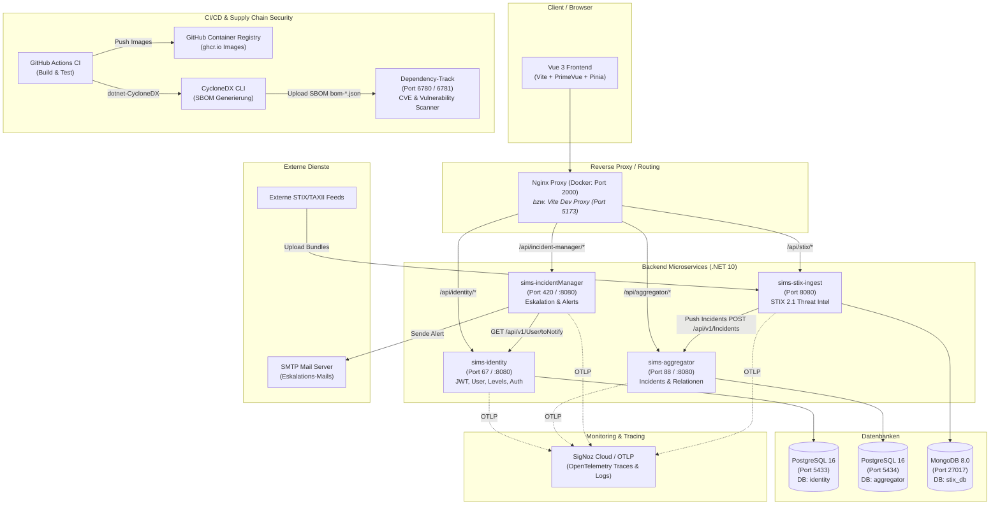
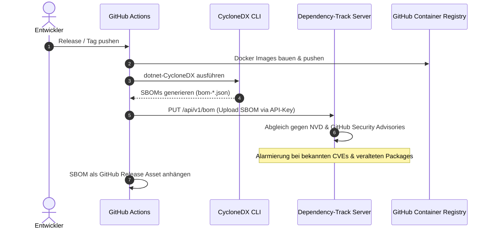

# Systemarchitektur & Komponenten

Überblick über die Services, Datenflüsse, Observability und Security-Pipeline (Dependency-Track).

---

## 🏗️ Gesamtsystem (Mermaid)

---

## 🧩 Services im Detail

### 1. `frontend` (Vue 3 + Vite)
- **Tech**: Vue 3, Vite, PrimeVue, Pinia, Vis-Network (Graphen-Visualisierung)
- **Dev-Modus**: Vite Dev-Server proxyed `/api/*` direkt auf die lokalen Backend-Ports
- **Docker-Modus**: Nginx serviert die statischen SPA-Dateien und fungiert als Reverse Proxy zu den Backend-Containern

### 2. `sims-identity` (.NET 10)
- **DB**: PostgreSQL (`identity`)
- **Aufgabe**: 
  - Registrierung, Login, JWT Access- & Refresh-Tokens
  - Rollen & Berechtigungsklassen (User, Level, Category)
  - Admin-Check & Liste der Notfall-Kontakte (`toNotify`)

### 3. `sims-aggregator` (.NET 10)
- **DB**: PostgreSQL (`aggregator`)
- **Aufgabe**:
  - Zentraler Daten-Hub für Security-Incidents
  - Speichert Incidents, Quelle (`taxii`, `raw json`) und Verknüpfungen (`Relationship`)
  - Soft-Delete mit Audit-Trail (`deleted_by`)

### 4. `sims-stix-ingest` (.NET 10)
- **DB**: MongoDB 8.0 (`stix_db`)
- **Aufgabe**:
  - Ingest von STIX 2.1 Threat-Intelligence JSON-Bundles
  - Speicherung der Rohdaten / Domain Objects in MongoDB
  - Normalisierung & Weiterleitung relevanter Incidents an `sims-aggregator`

### 5. `sims-incidentManager` (.NET 10)
- **DB**: Keine eigene DB (stateless)
- **Aufgabe**:
  - Eskalations-Management bei kritischen Incidents
  - Ruft `sims-identity` auf, um E-Mail-Adressen von berechtigten Admins abzufragen
  - Versendet Benachrichtigungen per SMTP mit Incident-Details

---

## 🛡️ CI/CD & Dependency-Track (Supply Chain Security)

- **SBOM Generierung**: Für jeden Service wird mit `dotnet-CycloneDX` eine standardisierte Software Bill of Materials generiert.
- **Dependency-Track**: Eigenständiger Container-Stack (`apiserver`, `frontend`, `postgres`), der jede Komponente auf bekannte Schwachstellen (CVEs) und Lizenzrisiken scannt.
- **Release-Artefakte**: SBOMs werden automatisch an jedes GitHub Release angehängt.

---

## 📊 Observability (SigNoz)

- Alle 4 .NET Services sind via OpenTelemetry SDK instrumentiert
- **Metriken & Tracing**: Automatische HTTP- und ASP.NET Core-Instrumentation
- **Logging**: Structured Logging mit Kontext (z.B. `{UserId}`, `{OrderId}`), direkt gestreamt an den SigNoz OTLP Collector
